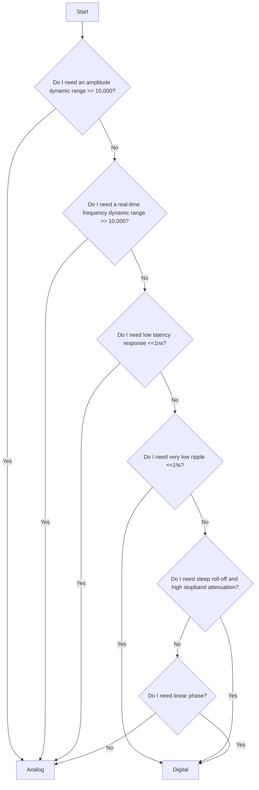

Source: https://www.dspguide.com/ch21/1.htm

```mermaid
graph TD;
    A[Start] --> C{Do I need an amplitude dynamic range >> 10,000?}
    C -->|Yes| D[Analog]
    C -->|No| E{Do I need a real-time frequency dynamic range >> 10,000?}
    E -->|Yes| D
    E -->|No| G{Do I need low latency response <<1ns?}
    G -->|Yes| D
    G -->|No| H{Do I need very low ripple <<1%?}
    H -->|Yes| B[Digital]
    H -->|No| I{Do I need steep roll-off and high stopband attenuation?}
    I --> |Yes| B
    I --> |No| J{Do I need linear phase?}
    J --> |Yes| B
    J --> |No| D
```
