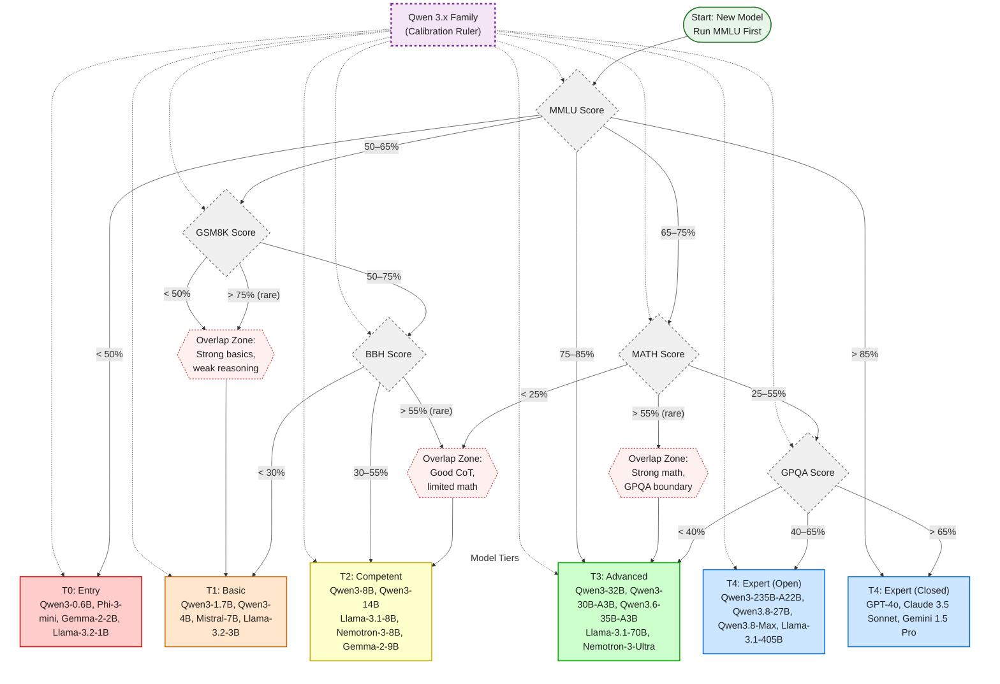

# LLM Reasoning Benchmark Tier Flowcharts

Quickly compare open-weight LLMs for reasoning by reviewing results across multiple publicly published benchmarks. Single benchmarks are insufficient: small models score 0 on advanced tests, large models saturate simple ones. This flowchart creates **tiers of models** and identifies **benchmarks that separate tiers** with clear pass/fail boundaries.

---

## Benchmark Comparison Table

| Benchmark | Full Name | Focus | Difficulty | Questions | Key Skill Tested |
|-----------|-----------|-------|------------|-----------|------------------|
| **MMLU** | Massive Multitask Language Understanding | 57 subjects (STEM, humanities, social sciences) | Medium | ~16K | Broad knowledge + basic reasoning |
| **GSM8K** | Grade School Math 8K | Multi-step arithmetic word problems | Easy–Medium | 8.5K | Basic multi-step reasoning |
| **BBH** | BIG-Bench Hard | 23 challenging BIG-Bench tasks | Hard | ~6.5K | Chain-of-thought multi-step reasoning |
| **MATH** | Mathematics Dataset | Competition-level math (precalc, algebra, geometry, etc.) | Hard | 12.5K | Advanced mathematical problem solving |
| **GPQA** | Graduate-Level Google-Proof Q&A | PhD-level physics, chemistry, biology | Very Hard | 448 | Expert scientific reasoning |
| **HumanEval** | Hand-Written Evaluation Set | Code generation (Python) | Medium–Hard | 164 | Programming reasoning |
| **ARC** | AI2 Reasoning Challenge | Grade-school science questions | Easy–Medium | 7.8K | Basic scientific reasoning |
| **HellaSwag** | Commonsense Reasoning | Sentence completion with commonsense | Easy | 70K | World knowledge / commonsense |

---

## Tier Thresholds (Soft Boundaries)

*Thresholds are approximate based on public leaderboard data (Open LLM Leaderboard, Papers With Code, HF Spaces). Models may fall in different tiers on different benchmarks—this is expected and informative. Tiers are defined by capability (benchmark scores), not model size.*

| Tier | MMLU | GSM8K | BBH | MATH | GPQA | HumanEval | Representative Models |
|------|------|-------|-----|------|------|-----------|----------------------|
| **T0: Entry** | 40–55% | 20–40% | 0–10% | 0–5% | ~25% (random) | 5–15% | Qwen3-0.6B, Phi-3-mini-3.8B, Gemma-2-2B, Llama-3.2-1B |
| **T1: Basic** | 55–65% | 50–75% | 20–35% | 10–20% | 30–35% | 20–35% | Qwen3-1.7B, Qwen3-4B, Mistral-7B, Llama-3.2-3B, Phi-3.5-mini |
| **T2: Competent** | 65–75% | 80–90% | 40–55% | 25–40% | 35–45% | 40–55% | Qwen3-8B, Qwen3-14B, Llama-3.1-8B, Nemotron-3-8B, Gemma-2-9B |
| **T3: Advanced** | 75–85% | 90–95% | 55–70% | 40–55% | 40–50% | 55–70% | Qwen3-32B, Qwen3-30B-A3B, Qwen3.6-35B-A3B, Llama-3.1-70B, Nemotron-3-Ultra, Qwen2.5-72B |
| **T4: Expert** | 85–92% | 95–98% | 70–85% | 55–75% | 50–65% | 70–85% | **Open:** Qwen3-235B-A22B, Qwen3.8-27B, Qwen3.8-Max, Llama-3.1-405B **Closed:** GPT-4o, Claude 3.5 Sonnet, Gemini 1.5 Pro |

---

## Diagram 1: Decision Tree Flowchart (Diamond Gates)

Progressive gating: each benchmark acts as a filter. Soft thresholds with overlap zones noted in parentheses.

**How to read:** Enter at **MMLU**. Follow the branch matching the model's score. Overlap zones (dashed pink) indicate models that pass one gate but fail the next—these are the most informative for understanding specific capability gaps.

---

## Usage Guide

### For Evaluating a New Model
1. Run **MMLU** first (cheap, broad signal)
2. Follow the decision tree (Diagram 1) to know which benchmark to run next
3. Stop when the model fails a gate—that's its tier ceiling
4. Compare against representative models in that tier

### Interpreting Overlap Zones
| Zone | Meaning | Action |
|------|---------|--------|
| MMLU 50–65% + GSM8K <50% | Memorizes facts, can't reason | Don't trust on multi-step tasks |
| GSM8K 50–75% + BBH <30% | Good arithmetic, weak CoT | Fine for simple math, fails complex reasoning |
| BBH 30–55% + MATH <25% | Reasoning works, math knowledge gaps | Supplement with tool use / calculator |
| MATH 25–55% + GPQA <40% | Strong STEM, not expert-level | Good for coding/engineering, not research |

### Updating Thresholds
Thresholds are soft. When new models are released:
1. Run the 5 core benchmarks (MMLU, GSM8K, BBH, MATH, GPQA)
2. Plot results against the tier threshold table
3. Adjust gate thresholds in Diagram 1 if tier boundaries shift
4. The Qwen 3.x family provides a stable internal ruler

---

## Data Sources & References

- **Open LLM Leaderboard** (Hugging Face H4): https://huggingface.co/spaces/HuggingFaceH4/open_llm_leaderboard
- **LMSYS Chatbot Arena** (Elo ratings): https://huggingface.co/spaces/lmarena-ai/arena-leaderboard
- **Papers With Code** (benchmark SOTA): https://paperswithcode.com/
- **EleutherAI LM Evaluation Harness**: https://github.com/EleutherAI/lm-evaluation-harness
- **Original benchmark papers**: MMLU (Hendrycks et al. 2021), GSM8K (Cobbe et al. 2021), BBH (Suzgun et al. 2022), MATH (Hendrycks et al. 2021), GPQA (Rein et al. 2023)
- **Qwen3.6-35B-A3B model card**: https://huggingface.co/Qwen/Qwen3.6-35B-A3B
- **Qwen3.8-27B model card**: https://huggingface.co/Qwen/Qwen3.8-27B
- **Qwen blog (Qwen3.8 benchmarks)**: https://qwen.ai/blog?id=qwen3.8

---

*Generated for quick LLM reasoning comparison. Thresholds approximate—verify with current leaderboard data before making deployment decisions.*